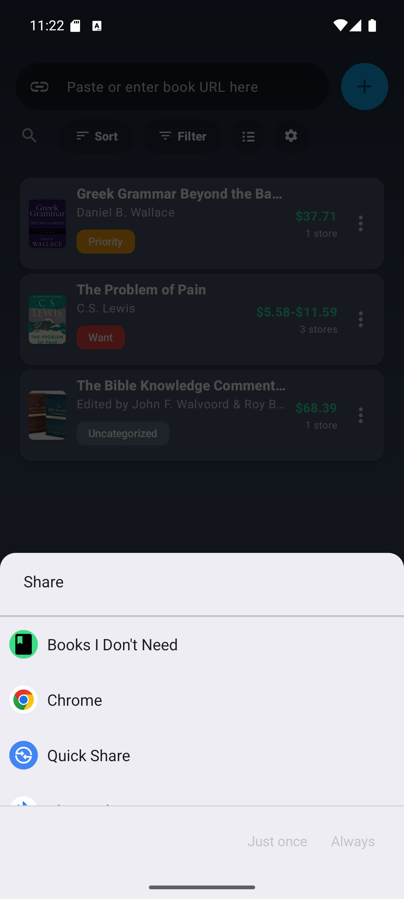
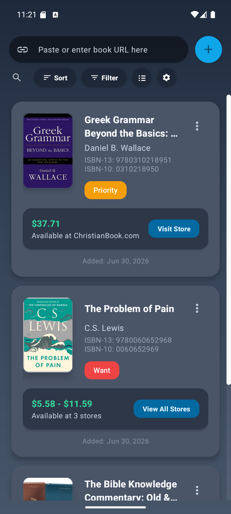
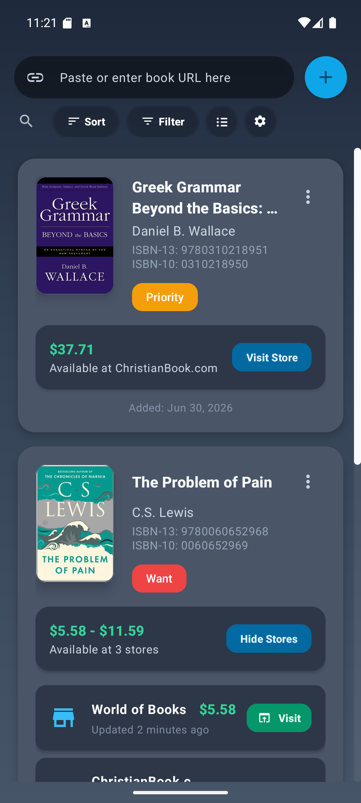
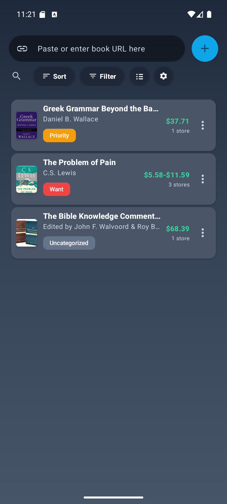
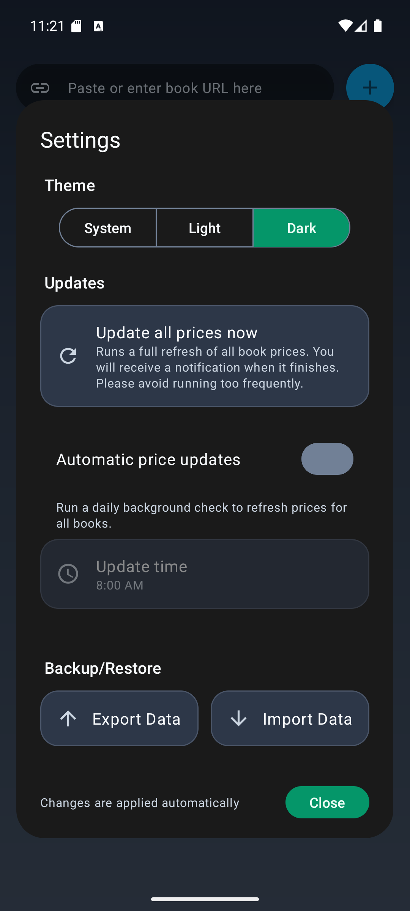
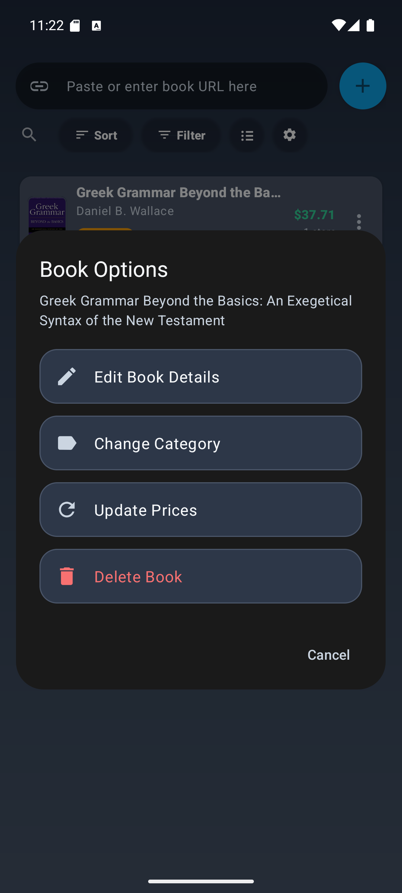
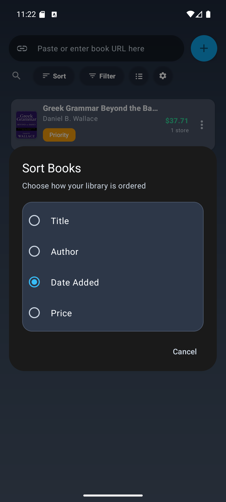
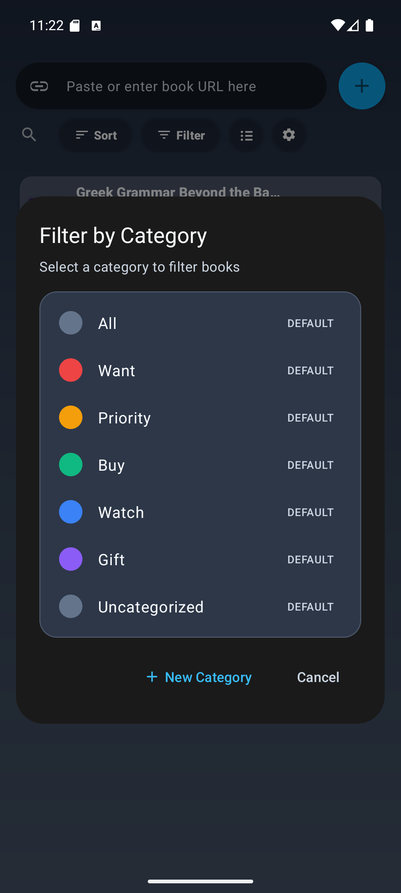

  

<h1 align="center">Books I Don't Need</h1>

  A small Android library for the books you are tempted to buy, but probably do not need yet.

Books I Don't Need keeps a wish list of book links and watches their prices across stores. When you find a book while browsing, share the page from Android's share sheet to **Books I Don't Need**. The app reads the store page, pulls in the title, author, ISBN, cover, price, and store link, then saves it to your library.

When another store has the same book, share that link too. Matching books are merged into one entry, so one book can show several stores, a low-to-high price range, and a store-by-store price list.

## Screenshots

<table>
  <tr>
    <td align="center"> <strong>Share from browsing</strong></td>
    <td align="center"> <strong>Full library cards</strong></td>
    <td align="center"> <strong>Merged store prices</strong></td>
  </tr>
  <tr>
    <td align="center"> <strong>Compact display</strong></td>
    <td align="center"> <strong>Themes and updates</strong></td>
    <td align="center"> <strong>Book options</strong></td>
  </tr>
  <tr>
    <td align="center"> <strong>Sort</strong></td>
    <td align="center"> <strong>Categories</strong></td>
    <td align="center"></td>
  </tr>
</table>

## How It Fits Into Browsing

1. Browse a book page in Chrome, Firefox, Amazon, eBay, or another store app/browser.
2. Tap **Share**.
3. Choose **Books I Don't Need** from the Android share sheet.
4. The app automatically saves the book and store price.
5. Share more store links for the same book to build a single comparison entry.

You can also paste a URL directly into the app, or use manual entry when a page cannot be parsed.

## What The App Tracks

- Book title, author, cover image, ISBN-10, ISBN-13, category, and date added.
- One or more store listings per book.
- Current price, price range, store URL, and last updated time.
- Duplicate store links, updated prices, and new stores for existing books.
- Recent price changes after background or manual refreshes.

## Library Tools

- **Price comparison:** expand a book to see every saved store sorted by price.
- **Two display modes:** full cards for detail, compact cards for scanning.
- **Search:** quickly filter the visible library by text.
- **Sort:** order books by title, author, date added, or price.
- **Categories:** filter by category and add custom categories with colors.
- **Book actions:** edit details, change category, update prices, delete books, open store pages, and copy book details.
- **Manual entry:** add books or store prices even when there is no compatible page.
- **CSV backup:** export or import library data.

## Price Updates

- Update prices for one book from its options menu.
- Run a full library refresh from settings.
- Enable daily automatic background updates.
- Choose an update time.
- Receive a notification summary when updates finish.
- Review recent price drops and increases.

## Appearance

Books I Don't Need supports **System**, **Light**, and **Dark** themes. The app also includes full and compact display modes, so the library can either show rich book details or a denser price watch list.

## Known Store Compatibility

The app has first-class parsers for these stores and domains:

| Store | Known compatible links |
| --- | --- |
| Amazon | `amazon.com`, `amazon.ca`, `amazon.co.uk`, `amazon.de`, `amazon.fr`, `amazon.it`, `amazon.es`, `amazon.co.jp`, `a.co/d/...` |
| eBay | `ebay.com`, `ebay.co.uk`, `ebay.ca`, `ebay.de`, `ebay.fr`, `ebay.it`, `ebay.es`, `ebay.com.au` |
| Barnes & Noble | `barnesandnoble.com`, `bn.com` |
| Books-A-Million | `booksamillion.com` |
| Book Outlet | `bookoutlet.com` |
| Better World Books | `betterworldbooks.com` |
| World of Books | `worldofbooks.com` |
| AbeBooks | `abebooks.com` |
| ThriftBooks | `thriftbooks.com` |
| Biblio | `biblio.com` |
| Biblestore.com | `biblestore.com` |
| ChristianBook.com | `christianbook.com` |
| Crossway | `crossway.org` |
| Google Books | `books.google.*`, `play.google.com/books` |
| Walmart | `walmart.com` book/product pages |
| Half Price Books | `hpb.com` |
| Logos Bible Software | `logos.com/product/...` |
| Valore Books | `valore.com` |

Other product pages may still work through the generic parser when the page exposes recognizable title, author, ISBN, cover, and price data. Store websites change frequently, so compatibility may need parser updates over time.
